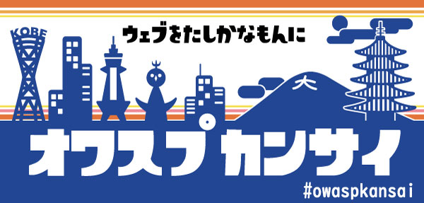
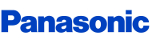

---

layout: col-sidebar
title: OWASP Kansai
tags: kansai
level: 0

region: Asia/Pacific

---

# OWASP Kansai  
Welcome to the Kansai chapter homepage. [Click Here](https://groups.google.com/a/owasp.org/forum/?hl=ja#!forum/kansai-chapter) to join the local chapter mailing list.  
OWASP Kansai ローカルチャプターのホームページへようこそ。 OWASP Kansaiのメーリングリストは [こちら](https://groups.google.com/a/owasp.org/forum/?hl=ja#!forum/kansai-chapter)。  

## About OWASP Kansai / オワスプカンサイ とは  
OWASP Kansaiチャプターは日本で2番目に発足したローカルチャプターです。  
OWASP Kansaiでは定期的にChapter Meeting / OWASP Nightと称した勉強会を開催しています。  
* OWASP Kansai が目指すもの
    * スキル、役職、業種、国籍、性別、年齢に関係なく、だれでも参加できる間口の広いコミュニティ  
    * カジュアルなスタイルで楽しくセキュリティについて情報交換や悩みを共有できる場  
    * 発表者、参加者が双方向に学びあえる場  
    * 関西（あるいは他のローカルチャプター）の人と人をつなぐハブ  

## The Open Web Application Security Project とは
OWASP／オワスプとは、「The Open Web Application Security Project」の略語であり、関西弁に翻訳するならば、 __「みんなの力で ウェブで できたもんの セキュリティを なんとかする活動」__ と表現できます。  
Webアプリケーションなどのソフトウェアのセキュリティと、セキュアなソフトウェア開発のための技術・プロセスについての情報提供/普及啓発を目的としたオープンコミュニティです。  

## 次回イベント  
*【学生優先・ハンズオン】体系的に学ぶモダン Web セキュリティ＠京都  
    * [参加登録はこちら](https://owasp-kansai.doorkeeper.jp/events/102007)  
    * 日時：2020-03-07（土）10:00-18:00  
    * 場所：サポーターズ　京都オフィス   
    * ※本イベントは学生優先です  
    

## 会員制度 / チャプタースポンサーシップ  
OWASPの各Projectやチャプターの活動はリーダーを含めすべて無報酬のボランティアにより成り立っています。これらはメンバーシップ会費やチャプターサポーターによるスポンサーなどのコントリビューションによって賄われています。

## Local Chapter Supporter  
<table cellpadding="15" cellspacing="0">
    <tr>
        <td></td>
    </tr>
</table>

<!--
### Single Meeting Supporter  
過去のイベントにおいて会場をご提供頂いた企業様、学校様です。
-->

## 各種会員制度、寄付について  
* [Individual Membership（個人会員）](https://www.owasp.org/index.php/Individual_Member): 50ドル（年間）、500ドル（ライフタイム）  
    * owasp.org メールアドレス付与  
    * 会員限定のニュース配信  
    * OWASPの組織の投票への参加  
    * ローカルミーティングへの優先入場を提供することもあります。  
    * 個人会員へのサインアップは[こちら](https://myowasp.force.com/memberappregion)から。  
    
* [Corporate Membership(企業・団体)](https://www.owasp.org/index.php/Corporate_Membership) : 5000ドル～（年間）、金額に応じてDiamond、Platinum、Gold、Silverのランク  
    * OWASPグローバルイベントにおける特典  
    * [Membershipページ](https://www.owasp.org/index.php/Corporate_Supporter_Bios)へのブランドロゴ掲載。
    * Kansaiサイトへの掲載。(KansaiをAllocationいただいた場合)  
    * 会費の一部を、支援したいプロジェクトやコミュニティに対してAllocationを行うことができます。（ぜひ、OWASP Kansai Chapterをご指定ください。ブランドロゴの掲載、リンクの設置をいたします。）  

* [Local Chapter Supporter(企業・団体)](https://www.owasp.org/index.php/Local_Chapter_Supporter) : 500ドル～（年間）、金額に応じてPlatinum、Gold、Silverのランク  
    * ローカルチャプターを限定した支援。  
    * Kansaiサイトへのブランドロゴの掲載、リンクの設置。

* [その他の支援](https://www.owasp.org/index.php/Membership#tab=Other_ways_to_Support_OWASP)  
    * [OWASPへの寄付](https://www2.owasp.org/donate)
    * 有償の貢献だけでなく、あなたがプロジェクト参画やイベント参加や発表も、OWASPへの貢献です。
　　* Chapter Meetingの会場をお貸しいただける方、スピーカーを務めて頂ける方、その他ご協力頂ける方はぜひ私たちまでご連絡ください。
　　* スピーカーの方は[Speaker Agreement:日本語訳](https://www.owasp.org/index.php/Speaker_Agreement:%E6%97%A5%E6%9C%AC%E8%AA%9E%E8%A8%B3)をご一読下さい。 
