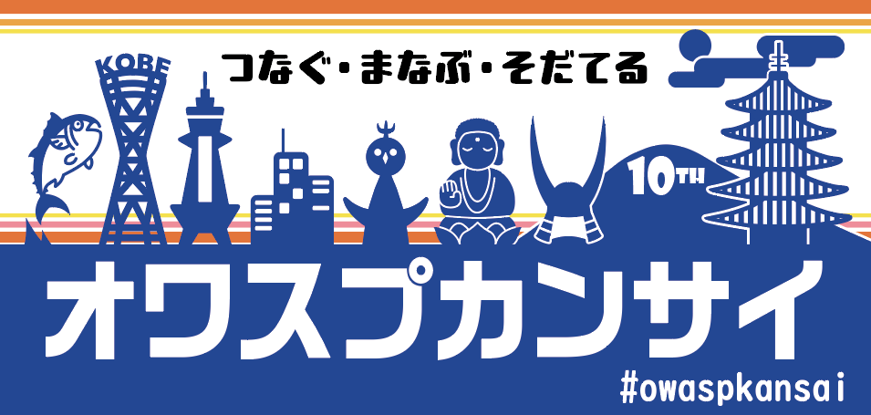
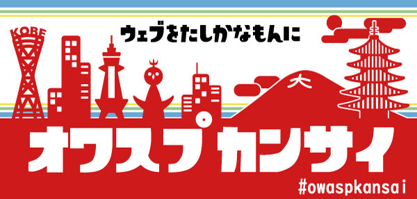
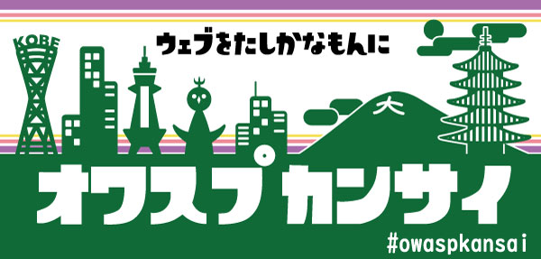
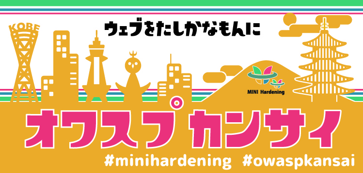

# OWASP Kansai Stickers

# OWASP Kansai Poster/Flyer
<a href="assets/pdf/OWASP_Kansai_Poster_20241203">
    OWASP Kansaiポスター(PDF)
</a> 
<a href="assets/pdf/owasp_kansai_flyer_2019.09.pdf">
    OWASP Kansaiフライヤー(PDF)
</a> 

# Adobe Illustrator data
<a href="assets/aidata/NewOwaspKansai_Blue_88x42_240904.ai">
    新デザイン(青)
</a> 
<a href="assets/aidata/NewOwaspKansai_lightBlue_88x42_240904.ai">
    新デザイン(水色)
</a> 
<a href="assets/aidata/old_OwaspKansai_Blue_88x42_nuritashi3.ai">
    旧デザイン(青)
</a> 
<a href="assets/aidata/oldOwaspKansai_Red_88x42_nuritashi3.ai">
    旧デザイン(赤)
</a> 
<a href="assets/aidata/oldOwaspKansai_Green_88x42_nuritashi3.ai">
    旧デザイン(緑)
</a> 
<a href="assets/aidata/A4clearfile_owasp_full_0202_outlined.ai">
    クリアファイル(top10-2017)
</a> 
<a href="assets/aidata/A4clearfile_owasp_iot_full_20190519.ai">
    クリアファイル(IoTtop10-2018)
</a> 
