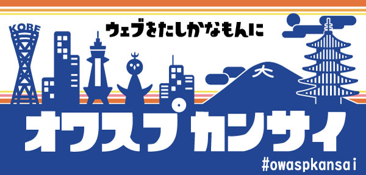

# OWASP Kansai Stickers

<object data="assets/images/owasp_kansai_flyer_2019.09.pdf" type="application/pdf" width="100%" height="100%">
   
<b>OWASP Kansaiフライヤー</b>: <a href="assets/images/owasp_kansai_flyer_2019.09.pdf">PDF をダウンロード</a>.

</object>

# Adobe Illustrator data
<a href="assets/images/NewOwaspKansai_lightBlue_88x42_240904.ai">
    新デザイン(青)
</a>
<a href="assets/images/NewOwaspKansai_lightBlue_88x42_240904.ai">
    新デザイン(水色)
</a>
<a href="assets/images/oldOwaspKansai_Blue.ai">
    旧デザイン(青)
</a>
<a href="assets/images/oldOwaspKansai_Green_88x42_nuritashi3.ai">
    旧デザイン(緑)
</a>
